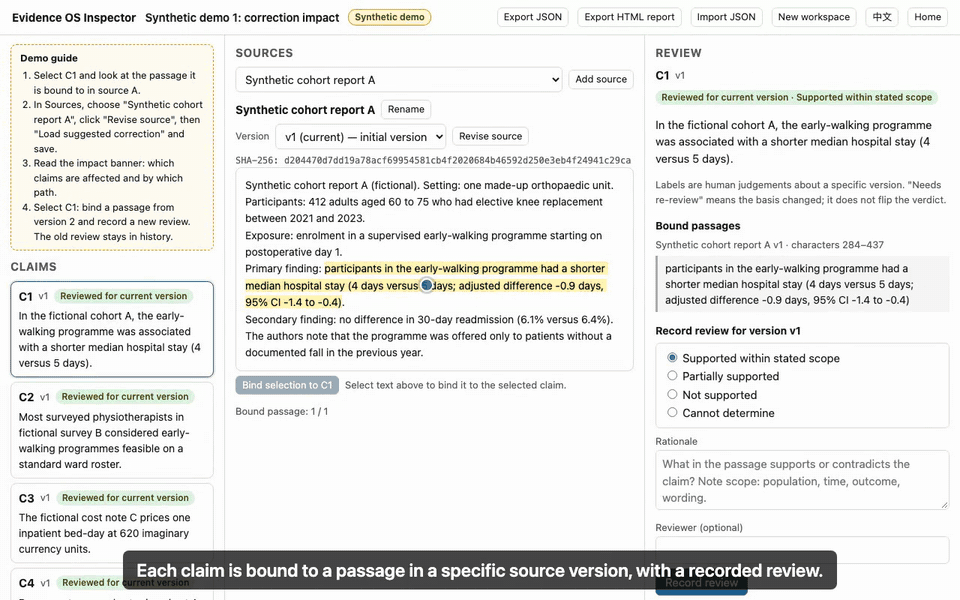
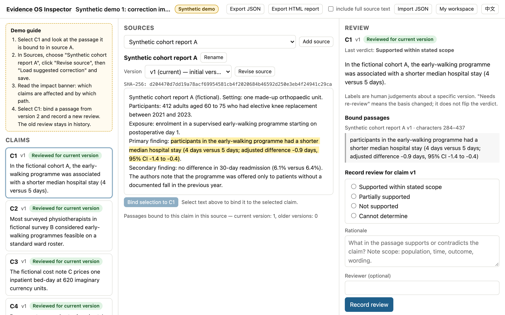
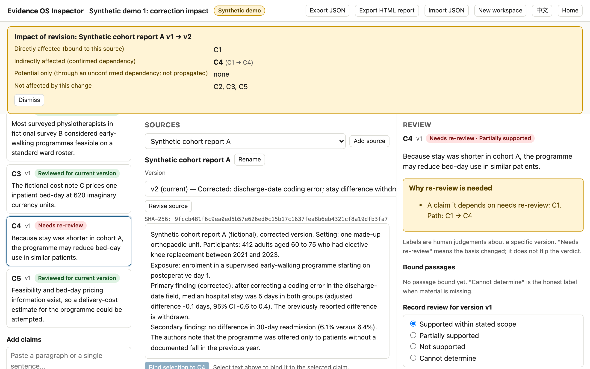
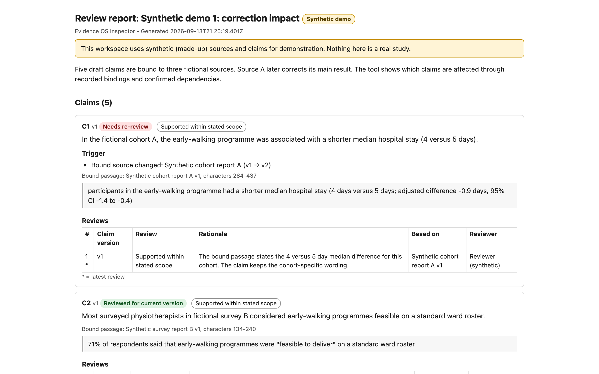

# Evidence OS Inspector

**See what changes when your evidence changes.**

Trace research claims to source passages, record reviews, and see which claims
need another look when a source changes. Runs entirely in your browser: no
account, no upload, no API key.

[中文说明](README.zh-CN.md) · **[Live demo](https://yinchuan123.github.io/evidence-os-inspector/)** · [Releases](https://github.com/yinchuan123/evidence-os-inspector/releases) · [FAQ](docs/FAQ.md) · [Roadmap](ROADMAP.md)

> **Status: v0.1 alpha.** Content location, structural checks, dependency
> tracking, change flags and report generation are automatic. Whether a passage
> actually supports a claim is a judgement a person records. See
> [What it does not do](#what-it-does-not-do).



## Try it in two minutes

1. Open the [live demo](https://yinchuan123.github.io/evidence-os-inspector/) and click **Try demo**.
2. Select claim **C1**. The passage it is bound to is highlighted in source A.
3. In *Sources*, pick "Synthetic cohort report A", click **Revise source**, then **Load suggested correction**, and save.
4. Read the impact banner: **C1** is affected directly, **C4** through a confirmed dependency, and C2, C3, C5 are not affected.
5. Select C1, bind a passage from version 2, record a new review. The old review stays in history.
6. **Export HTML report** to get a standalone file you can send to a co-author.

Then click **Review your text**, paste a paragraph of your own, split it into
claims, add the source text you are checking against, and do the same.

All demo studies are invented. They show the mechanics, not real evidence.

## Screenshots

| Claim bound to a source passage | Impact of a source correction | Standalone HTML report |
|---|---|---|
|  |  |  |

## Three scenarios

1. **Correction impact.** Five claims, three sources, two confirmed dependencies.
   Source A corrects its main result. The tool computes, from recorded bindings
   and confirmed dependencies, that C1 and C4 need re-review and the rest do not.
2. **Scope check.** A source reports an association in adults over 70 with a
   specific outcome. One draft sentence generalises the population, swaps the
   outcome, and uses causal wording. The reviewer's rationale records each
   mismatch against the bound passage.
3. **Missing, then supplemented.** A claim cannot be judged from the trial
   summary. The appendix is added later, the claim is bound to it and
   re-reviewed. The earlier "cannot determine" verdict remains in history.

## How it works

- **Versions are immutable.** Editing a source or a claim creates a new version
  with a SHA-256 content hash. Old versions stay.
- **Bindings are positional.** A claim is bound to a character span in one
  specific source version. No page numbers are invented for plain text.
- **Reviews are anchored.** A review records a label, a rationale, and exactly
  which source versions and upstream claim reviews it was based on.
- **Dependencies are explicit.** You add claim-to-claim links and mark them
  confirmed or unconfirmed. Cycles and dangling references are rejected.
- **Nothing flips automatically.** When a basis changes, the claim is marked
  *Needs re-review* with the reason and the dependency path. Unconfirmed links
  only produce a "potential impact" note.
- **Export is explicit.** JSON keeps everything for continued work; the HTML
  report contains claims, bound passages, states and history, without full
  source text unless you ask for it.

Details: [docs/CONCEPTS.md](docs/CONCEPTS.md) · JSON format: [docs/FORMAT.md](docs/FORMAT.md)

## What it does not do

- It does not decide whether a passage supports a claim. You do.
- It does not verify DOIs or URLs, and it does not fetch papers. Identifiers are
  stored as *user-provided, not verified*.
- No PDF or OCR import, no AI reading, no database, no multi-user server, no
  automatic GRADE or meta-analysis. See the [roadmap](ROADMAP.md) for what is
  being considered next.
- A content hash shows whether recorded text changed. It says nothing about
  scientific truth, authorship, or meaning.

## Privacy

Your text is processed in the browser. The production build ships a strict
Content-Security-Policy that forbids any network connection after load
(`connect-src 'none'`). Exporting creates a local file. Ordinary web-server
access logs for the hosting page belong to GitHub Pages, like any static site.

## Run locally

Requires Node.js 20 or newer.

```bash
git clone https://github.com/yinchuan123/evidence-os-inspector.git
cd evidence-os-inspector
npm ci
npm run dev
```

Open http://localhost:5173. Other commands:

```bash
npm test            # unit tests (vitest)
npm run build       # production build in dist/
npm run verify      # typecheck + lint + tests + Pages build + e2e (needs: npx playwright install chromium)
```

## Input formats

- Paste text, or import `.txt` / `.md` into the claims box or as source text.
- Import a workspace JSON exported by this tool (`eosi-workspace`, format 0.1).

## Contributing

Real usage reports are the most valuable contribution right now. See
[CONTRIBUTING.md](CONTRIBUTING.md).

## License and citation

Code is released under the [MIT License](LICENSE). To cite the software, use
the metadata in [CITATION.cff](CITATION.cff) (GitHub shows a "Cite this
repository" button).

## Relation to Evidence OS

Inspector is a small, standalone tool extracted from a larger private
evidence-compilation system. It shares the ideas of versioned sources,
positional bindings, and correction propagation, but it is not that system and
does not include its data. Any future public interface will be listed in the
roadmap only when real public material exists.
